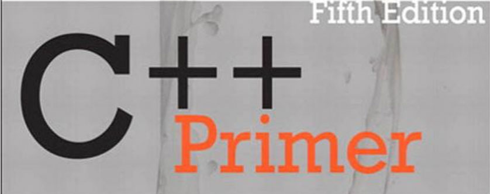

# Обучение по книге stanley lippman c++ primer
Описание скопировано с сайта: 
Язык программирования C++. Базовый курс - это книга для абсолютных новичков не только в С++, но и в программировании вообще. Книга считается одним из лучших пособий по самостоятельному обучению языку. Пятое издание было полностью пересмотрено и обновлено до 11 стандарта, так что поможет быстро и эффективно изучить как сам язык с самого нуля, так и его передовые возможности. Авторы показывают использование базового языка и его стандартной библиотеки для разработки эффективного, читабельного и мощного кода.

